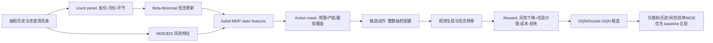

# DQN 建模流程图

```mermaid
flowchart LR
  A["抽检历史与浓度清洗表"] --> B["count panel: 省份-月份-环节"]
  B --> C["Beta-Binomial 信念更新"]
  A --> D["MOE/EDI 风险特征"]
  C --> E["belief-MDP state features"]
  D --> E
  E --> F["Action mask: 预算/产能/最低覆盖"]
  F --> G["候选动作: 整数抽检配置"]
  G --> H["观测生成与信念转移"]
  H --> I["Reward: 风险下降+信息价值-成本-损失"]
  I --> J["DQN/Double DQN 候选"]
  J --> K["与随机/历史/风险排序/MOE优先 baseline 比较"]
```
